# Rapport de Projet en Visualisation d'Information

# 1\. Introduction

Ce rapport présente les différentes étapes de la réalisation d'un projet de visualisation d'information, de l'analyse des données brutes à la création de 5 représentations visuelles distinctes pour un seul et même dataset : celui de la Coupe du Monde de la FIFA 2022\.  
Le projet vise à explorer les techniques de visualisation de données multivariées. L'objectif est de démontrer comment, à partir d’une même base de données, un développeur est capable d’offrir des lectures et des compréhensions totalement différentes. En effet, chaque type de visualisation met en avant certains aspects ou relations spécifiques des données, permettant ainsi de répondre à des objectifs d'analyse variés.

# 2\. Choix du Dataset et Validation

## 2.1 Critères de Sélection

Le choix du dataset s'est basé sur plusieurs critères essentiels pour répondre aux exigences du projet :

* **Multivarié :** Le dataset doit contenir plusieurs variables afin de permettre des analyses complexes et des visualisations riches.  
* **Intéressant :** Le dataset doit permettre de réaliser 5 visualisations différentes  
* **Taille :** Le dataset doit contenir assez de données pour que les valeurs et l’analyse de celles-ci ait un sens

## 2.2 Dataset Sélectionné

Après exploration de diverses options, le dataset suivant a été choisi :

**Nom du Dataset : Fifa World Cup 2022: Complete Dataset**

**Lien :** [https://www.kaggle.com/datasets/die9origephit/fifa-world-cup-2022-complete-dataset](https://www.kaggle.com/datasets/die9origephit/fifa-world-cup-2022-complete-dataset)

Ce dataset contient les statistiques détaillées pour chaque match de la Coupe du Monde 2022, incluant les scores, la possession, les types de tirs, les actions défensives, et les zones d'activité sur le terrain.

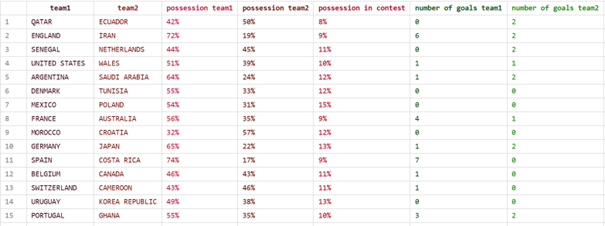

Le dataset un total de 88 informations différentes par match.

# 3\. Utilisateurs Cibles et Objectifs de Visualisation

## 3.1 Utilisateurs Cibles

Les utilisateurs cibles de ces visualisations sont principalement des journalistes sportifs, des analystes de données amateurs, ou des fans de football souhaitant approfondir leur compréhension des performances des équipes et de la physionomie des matchs. Avec nos visualisations, les utilisateurs seront capables de déterminer le style de jeu de chaque équipe nationale. 

## 3.2 Objectifs de Visualisation et Tâches Utilisateur

Les objectifs de cette visualisation sont les suivants :

* **Objectif 1 : Analyser en profondeur la physionomie d'un match spécifique.** (Visualisation : Graphique à Bulles)

  * **Tâche Utilisateur 1.1 :** Comparer le nombre de but d’un match en fonction d’un paramètre du style de jeu de l'équipe 1 par rapport a un parametre de celui de l’équipe 2  
  * **Tâche Utilisateur 1.2 :** Naviguer dans l'espace de données grâce au zoom (molette) et au panoramique (cliqué-glissé)  
  * **Tâche Utilisateur 1.3 :** Cliquer sur une bulle de match pour ouvrir une fenêtre d'analyse détaillée.  
  * **Tâche Utilisateur 1.4 :**  Interagir avec cette fenêtre (la déplacer, la fermer) pour la comparer à d'autres.  
  * **Tâche Utilisateur 1.5 :**  Analyser les graphiques comparatifs sur la possession, l'analyse spatiale, les types de réception, les passes, la pression défensive et les tirs.

* **Objectif 2 : Comparer la performance des équipes au sein du tournoi.** (Visualisation : Matrice des matchs)

  * **Tâche Utilisateur 2.1 :** Identifier rapidement les confrontations entre équipes grâce à la disposition en grille (lignes \= équipes locales, colonnes \= équipes visiteurs).  
  * **Tâche Utilisateur 2.2 :** Repérer les performances relatives (victoires, égalités, défaites) à l'aide du code couleur et des matchs participés  représenté dans chaque cellule.  
  * **Tâche Utilisateur 2.3 :** Cliquer sur une cellule de match pour afficher un graphique circulaire présentant la répartition de la possession de la balle entre les deux équipes.  
  * **Tâche Utilisateur 2.4 :**  Interagir avec le donut de possession : cliquer sur la possession d’une équipe permet d’afficher un second graphique détaillant ses tentatives de tir (à l'intérieur ou à l'extérieur de la raquette) et ses buts marqués.  
  * **Tâche Utilisateur 2.5 :**  Analyser la domination d’une équipe à travers la comparaison des deux anneaux (possession vs efficacité offensive).  
  * **Tâche Utilisateur 2.6 :**  Filtrer les matchs selon la période, la phase du tournoi ou le nombre de buts marqués à l’aide de sélecteurs afin de suivre l'évolution des performances au fil de la compétition.  
    

* **Objectif 3 : Explorer la relation entre les caractéristiques des équipes et le résultat d’un match**

  * **Tâche Utilisateur 3.1 :** Sélectionner les métriques x,y via les menus pour visualiser la relation entre deux indicateurs (ex : possession vs tir cadrés)

  * **Tâche Utilisateur 3.2 :** Survoler un point pour voir le résumé d’un match (équipes, date, phase etc…)

  * **Tâche Utilisateur 3.3 :** Cliquer sur un point pour ouvrir le panneau latéral de détails du match

  * **Tâche Utilisateur 3.4 :** Identifier les équipes ou les matchs atypiques et leur impact sur le tournoi

  * **Tâche Utilisateur 3.5 :** Détecter des regroupements (clusters) en fonction de la corrélation de métriques x,y et comprendre l’impact sur le résultat d’un match

* **Objectif 4 : Analyser les interactions et la structure du tournoi.** (Visualisation : Match Network)

  * **Tâche Utilisateur 4.1 :** Identifier les relations entre équipes grâce à la représentation en graphe (chaque lien correspondant à un match disputé).

  * **Tâche Utilisateur 4.2 :** Filtrer les matchs selon un groupe spécifique (A à H) pour observer les confrontations internes à ce groupe.

  * **Tâche Utilisateur 4.3 :** Activer la case “Knockout Only” pour isoler les matchs des phases finales (huitièmes, quarts, demi-finales, finale).

  * **Tâche Utilisateur 4.4 :** Cliquer sur un nœud pour afficher un tableau récapitulatif des performances de l’équipe (buts marqués, encaissés, différence de buts et liste des adversaires rencontrés).

  * **Tâche Utilisateur 4.5 :** Analyser la densité des liens et la position centrale des équipes pour visualiser la progression dans le tournoi.

* **Objectif 5 : Comparer les profils tactiques et les styles de jeu des équipes.** (Visualisation : Coordonnées Parallèles \+ graphique radar)

  * **Tâche Utilisateur 5.1 :** Suivre la ligne d'une équipe à travers de multiples axes statistiques (Possession, Efficacité, Précision des passes, Jeu central, etc.) pour comprendre son style de jeu global. 

  * **Tâche Utilisateur 5.2 :** Comparer les équipes en observant comment les lignes se croisent ou se regroupent sur certains axes (par ex: identifier toutes les équipes à forte possession). 

  * **Tâche Utilisateur 5.3 :** Filtrer la vue pour n'afficher que les équipes d'un groupe spécifique (A-H), celles ayant atteint une certaine phase finale (ex: demi-finalistes), ou en recherchant une équipe par son nom. 

  * **Tâche Utilisateur 5.4 :** Survoler une ligne pour afficher une infobulle (tooltip) contenant un graphique radar. 

  * **Tâche Utilisateur 5.5 :** Analyser ce graphique radar pour comparer les statistiques de performance brutes de l'équipe (Buts, Tirs, Passes, Pressions) par rapport à la moyenne de l'ensemble du tournoi. 

  * **Tâche Utilisateur 5.6 :** Cliquer sur une ligne pour la sélectionner (la "verrouiller"), l'isolant visuellement des autres et mettant à jour les filtres pour correspondre à cette équipe.

# 4\. Proposition de Technique de Visualisation avec D3.js

## 4.1 Technique de Visualisation

Plutôt qu'une seule technique, le projet implémente 5 visualisations distinctes. Pour naviguer entre les différentes visualisations, nous avons une page d'accueil qui réunit toutes nos visualisations

 

## 4.2 Visualisation 1 : Graph a bulle Interactif (bubble chart)

* **Description :** Chaque match est une bulle dont la taille est proportionnelle au nombre total de buts. Chaque bulle est divisée en deux demi-cercles, remplis avec les drapeaux des deux équipes.

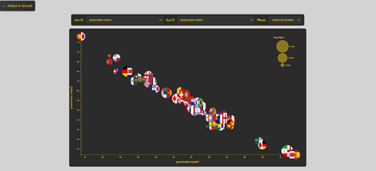

* **Interactions Clés :** Navigation par Panoramique et Zoom. Au clic sur une bulle, une fenêtre s'ouvre. Cette fenêtre est déplaçable (drag-and-drop) et refermable. Elle affiche un tableau de bord complet du match avec des graphiques en barres empilées D3.js comparant les équipes sur : la possession, l'analyse spatiale, la réception, les passes, la pression, et les tirs.

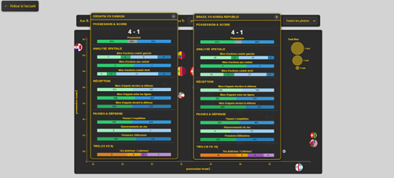

## 4.3 Visualisation 2 : Matrice interactive (classic chart)

* **Description :** Chaque cellule du tableau est un match. Sa couleur determine si l’equipe locale a perdu (rouge), gagne (vert) ou s’il y a eu une egalite (jaune).  
  Sur chaque ligne, les équipes locales sont colorées des trois couleurs rouge, jaune et vert. La proportion de chaque couleur représente la proportion de défaites, égalités et victoires en fonction de tous les matchs à laquelle l'équipe a participé. Chaque colonne représente l'équipe visiteur dans les matchs.  
    
  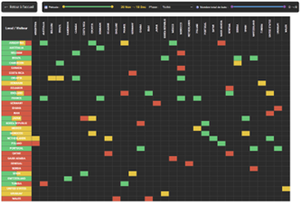  
* **Interactions Clés :** Navigation par zoom. Au clic sur une cellule, une fenêtre s’ouvre. Cette fenêtre affiche un graphique circulaire représentant le pourcentage de possession de la balle par chaque équipe tout au long du match. Lors du clic sur l’un des éléments de ce graphique, une autre fenêtre s’ouvre. Celle-ci affiche un autre graphe circulaire représentant les tirs de l'équipe concernée (tentatives dans et en dehors de la raquette, le nombre de buts marqués dans et en dehors de la raquette et le nombre de buts marqués au total).  
  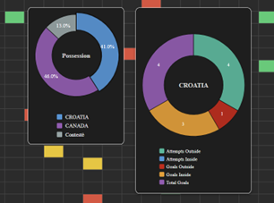

## 4.4 Visualisation 3 : Nuage de points (scatter plot)

* **Description :** Chaque cercle représente un match. Tous les points ont des coordonnées sur un axe x,y qui représentes deux métriques sélectionnables par l'utilisateur (par ex. possession équipe 1, buts équipe 1, tentatives etc...). Chaque cercle à une taille fixe pour chaque match. L'intérieur de chaque cercle est composée de 2 demi drapeaux qui représentent les équipes qui se sont affronter pendant le match. La couleur extérieur du cercle représente la phase du tournoi(groupe ou phases éliminatoire). Lorsque l'on clique sur un match un panneau latéral avec des informations supplémentaires sur le match s'ouvre sur le côté  
  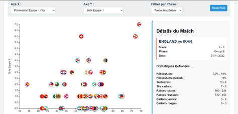  
    
* **Intéractions clés :**   
  * Sélection des axes : menus déroulants pour choisir la métrique X et la métrique Y — le graphique se redessine automatiquement.  
  * Filtrage par phase : menu pour filtrer les points selon la phase (all / group / knockout / ...).  
  * Tooltip au survol : survoler un point affiche une infobulle contenant le match résumé (Équipe1 vs Équipe2, phase, date, valeurs X & Y).   
  * Click → panneau  de détails, zoom sémantique : clic sur un point ouvre le panneau \#match-details contenant le détail des statistiques du match (score, possession, tirs, passes, cartons, etc.).  
  * Légende  : montre les couleurs correspondant aux catégories/phases.  
  * Reset contrôles : bouton pour remettre axes et filtres à l'état initial et redessiner.

## 4.5 Visualisation 4 : Match network

* **Description :**

Cette visualisation présente l’ensemble des matchs de la Coupe du Monde 2022 sous forme de réseau interactif.  
 Chaque équipe est représentée par un nœud circulaire affichant son drapeau et son nom.  
 Les liens entre deux nœuds indiquent qu’un match a eu lieu entre ces équipes.  
 L’épaisseur du lien est proportionnelle au nombre total de buts marqués pendant le match, et sa couleur reflète la phase du tournoi :

* couleurs vives pour les phases de groupes,  
  * rouge pour les phases à élimination directe.

L’objectif est d’obtenir une vue d’ensemble des affrontements et des interactions entre équipes, en conservant une lecture fluide et esthétique du tournoi.

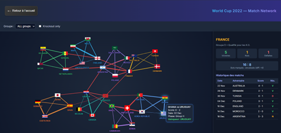  
*Vue d’ensemble du graphe complet : toutes les équipes et tous les matchs visibles.*

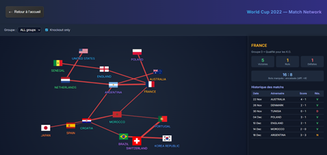

*Mode “Knockout Only” activé : affichage des phases finales uniquement (huitièmes à finale).*

* **Interactions clés :**  
  * Zoom et déplacement libre : l’utilisateur peut naviguer dans le graphe à l’aide de la molette et du clic-glissé.  
  * Sélecteur de groupe : permet de n’afficher que les matchs du groupe choisi (A à H) ou bien l’ensemble du tournoi.  
  * Case “Knockout Only” : lorsqu’elle est cochée, seuls les matchs des phases finales (huitièmes, quarts, demi-finales, finale) sont affichés.  
  * Survol d’une équipe : le cercle de contour s’illumine, facilitant la lecture dans le graphe dense.  
  * Clic sur une équipe : un panneau latéral affiche un tableau récapitulatif indiquant :  
    * le nombre total de matchs joués,  
    * le nombre de buts marqués et encaissés,  
    * la différence de buts,  
    * et la liste détaillée de tous les adversaires rencontrés avec le score de chaque rencontre.

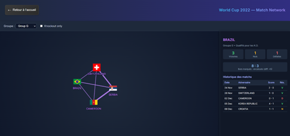  
*Filtrage sur un groupe spécifique : seules les équipes et rencontres du groupe sont affichées.*

## 4.6 Visualisation 5 : Coordonnées parallèles \+ graphique radar

* **Description :** Cette visualisation implémente une technique combinée à deux niveaux pour une analyse complète des équipes :  
  * **Niveau 1 \- Coordonnées Parallèles :**  
    La vue principale est un graphique en coordonnées parallèles où chaque équipe est représentée par une ligne. Les axes verticaux ne représentent pas des volumes bruts, mais des métriques de style de jeu et d'efficacité (ex: "Possession %", "Efficacité %", "Précision Passes %", "Jeu Latéral"). Le tracé de la ligne crée un "profil tactique" visuel immédiat. Cela permet à l'utilisateur de comparer les philosophies de jeu (ex: identifier les équipes à forte possession vs. les équipes de contre-attaque). Les lignes sont colorées selon le groupe d'origine de l'équipe (A-H).  
  * **Niveau 2 \- Radar Chart :**  
    Le second niveau de visualisation est un graphique radar qui apparaît au survol d'une équipe. Ce radar abandonne le style pour se concentrer sur la performance brute (ex: "Buts p. Match", "Tirs p. Match", "Buts concédés"). La forme de l'équipe est directement superposée à la forme de la "Moyenne du tournoi", offrant une comparaison instantanée de ses forces et faiblesses par rapport à la compétition.

| 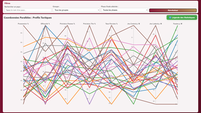 |
| :---: |
| *Vue d'ensemble des profils tactiques (32 équipes)* |

| 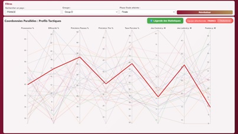 |
| :---: |
| *Interaction de sélection (Niveau 1\) \- Profil de la France* |

| 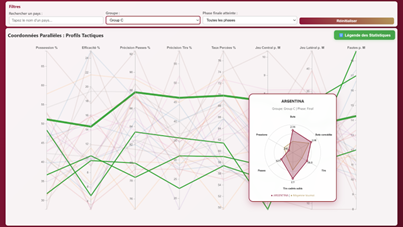 |
| :---: |
| *Interaction de survol (Niveau 2\) \- Analyse radar de l'Argentine* |

* **Intéractions clés :**  
  * **Filtrage (Niveau 1\) :** L'utilisateur peut filtrer les profils affichés dans les coordonnées parallèles via des menus déroulants (Groupe, Phase atteinte) ou une recherche textuelle (Nom du pays).  
  * **Sélection (Niveau 1\) :** Un clic sur une ligne "verrouille" la sélection sur cette équipe. La ligne reste en surbrillance tandis que les autres sont estompées, et les filtres se mettent à jour pour refléter l'équipe choisie.  
  * **Survol → Activation du Niveau 2 :** L'interaction centrale est le survol d'une ligne (équipe) dans la vue Niveau 1\. Cette action active la visualisation de Niveau 2 (le graphique radar) dans une infobulle, permettant à l'utilisateur de "zoomer" analytiquement sur la performance de cette équipe.  
  * **Analyse Comparée (Niveau 2\) :** Dans le radar, l'utilisateur compare visuellement les deux polygones (équipe vs. moyenne) pour évaluer ses performances brutes (ex: "forte attaque mais défense faible").  
  * **Légende Modale :** Un bouton ouvre une fenêtre expliquant la signification des axes pour les deux niveaux de visualisation (les métriques de style du L1 et les métriques de performance du L2).

# 5\. Démonstration Exécutable

La démonstration est structurée comme un mini-site web statique. Les fichiers incluent :

* `index.html` : La page d'accueil avec des liens vers les deux premières visualisations.  
* Une page par visualisation

Pour démarrer le projet, se mettre à la racine et faire un “npm start”

# 6\. Conclusion

Ce projet a permis de mettre en œuvre un processus complet de visualisation d'information. En utilisant D3.js, nous avons démontré comment 5 paradigmes de visualisation peuvent extraire des informations de nature radicalement différente à partir d'un même jeu de données. Cette approche modulaire répond à des questions d'analyse variées, allant du simple résumé d'un résultat à une analyse tactique détaillée d'un match.